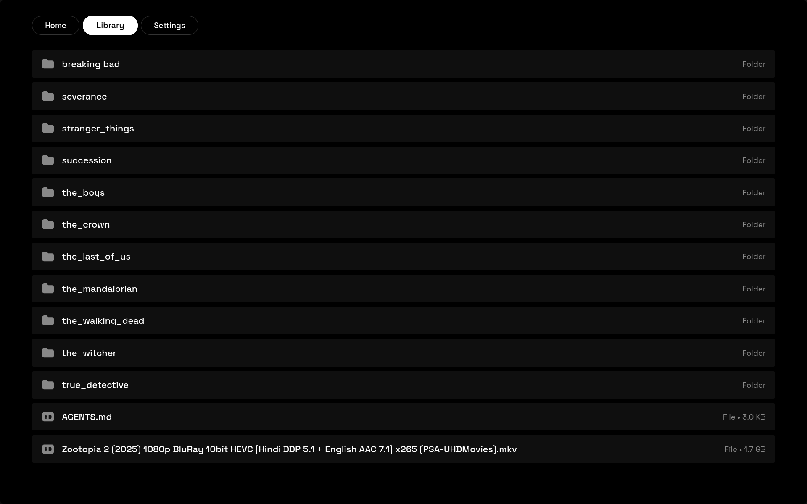

# ALEX TV

A sleek Android TV app for browsing movies and TV shows, powered by TMDB.




## Features

- Browse Trending and Popular movies
- Full-screen hero backdrop that updates as you navigate
- D-pad spatial navigation optimized for Android TV remotes
- Local media library browser with file streaming
- Skeleton loading animations
- Dark, minimal UI built with Space Grotesk

## Download

Grab the latest APK from [Releases](https://github.com/lunatestus/ALEX-TV/releases/tag/latest).

## Tech Stack

- **Android WebView** — wraps a lightweight HTML/CSS/JS frontend
- **Kotlin** — native Android TV shell with D-pad key mapping
- **TMDB API** — movie and TV show data
- **GitHub Actions** — automated builds with rolling release

## Build

The app builds automatically via GitHub Actions on every push to `main`. To build locally:

```bash
./gradlew assembleDebug
```

APK output: `app/build/outputs/apk/debug/app-debug.apk`

## Troubleshooting

### A/V desync on pause/resume with 7.1 surround audio

**Symptom:** After pausing and resuming playback, audio and video are out of sync by 3–4 seconds. Video appears to jump ahead, requiring a manual seek to realign. This issue is specific to 7.1 (8-channel) audio tracks — 5.1 tracks work fine.

**Root cause:** Two compounding issues:

1. **Tunneling was disabled** (`setTunnelingEnabled(false)`). Without tunneling, audio and video render on separate clocks. When paused, the video clock stops immediately but the audio decoder continues draining its larger internal buffer (7.1 has 8 channels vs 6, meaning larger frames and longer drain time). This causes audio jitter during pause.

2. **Clock drift on resume.** Even with tunneling enabled, ExoPlayer's hardware renderer doesn't perfectly realign audio and video clocks after a pause. The decoded frames advance internally during pause but never reach the output pipeline, so on resume the two tracks start from slightly different timestamps.

**Fix (in `PlayerScreen.kt`):**

- **Enabled tunneling mode** (`setTunnelingEnabled(true)`) — ties audio and video to a single hardware clock on Android TV, eliminating the pause-time audio jitter.
- **Added `playerPause()` / `playerPlay()` wrappers** — `playerPause()` records the exact `currentPosition` before calling `exoPlayer.pause()`. `playerPlay()` calls `exoPlayer.seekTo(recordedPosition)` before `exoPlayer.play()`, which flushes both decoder pipelines and forces them to resync to the same timestamp.
- Only user-initiated pause/resume (DPad center, space, media play/pause) uses these wrappers. Scrubbing and lifecycle events (app backgrounding) use direct `exoPlayer.pause()`/`play()` since they have their own resync logic.
- `wasPausedAtMs` is cleared when `STATE_READY` fires so stale pause positions don't interfere with new media items.

## License

MIT
